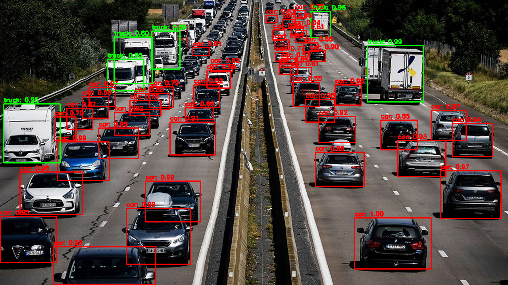

### **Title**:  
**Object Detection with YOLOv3: Traffic Object Classification and Visualization**

### **Description**:  
This project implements **YOLOv3 (You Only Look Once)**, a state-of-the-art object detection model, using OpenCV and Python to detect, classify, and highlight objects in images. The repository offers a step-by-step guide to detect objects like cars and trucks with bounding boxes, while also demonstrating customization for class-specific visual styling. The project is designed to be user-friendly, leveraging Google Colab to eliminate the need for local installations or hardware requirements.

#### **Features**:
- **Pre-trained YOLOv3 Model**: Utilizes YOLOv3 weights trained on the COCO dataset for robust object detection across 80 predefined classes.
- **Class-Specific Styling**: Implements a color-coding system where:
  - **Cars** are highlighted in **red**.
  - **Trucks** are highlighted in **green**.
- **Non-Maximum Suppression (NMS)**: Reduces duplicate bounding boxes for overlapping detections, ensuring clarity and accuracy.
- **Interactive Image Upload**: Allows users to upload their own images for testing and analysis.
- **Ease of Use**: Designed for beginners and experts, requiring only a web browser and access to Google Colab to get started.

#### **Example Detection**:
This project includes an example of detecting cars and trucks on a busy highway. Below is a sample result showing **cars highlighted in red** and **trucks in green**, showcasing YOLOv3's ability to handle dense, complex traffic scenes.

  

Key Insights from the Example:
- The image demonstrates YOLOv3's capability to detect multiple objects accurately even in dense environments.
- Objects like cars and trucks are clearly distinguished with confidence scores displayed for each detection.
- The output highlights the efficiency of YOLOv3 in processing high-resolution traffic images.

#### **How It Works**:

1. **Download YOLOv3 Files**:
   - The script automatically downloads:
     - Pre-trained weights (`yolov3.weights`).
     - Configuration file (`yolov3.cfg`).
     - COCO dataset class names (`coco.names`).

2. **Upload an Image**:
   - Use Google Colab’s file upload feature to add an image for testing. 

3. **Preprocess the Image**:
   - The uploaded image is resized and normalized using OpenCV to meet YOLOv3's input requirements.

4. **Run the Detection Pipeline**:
   - A forward pass through the YOLOv3 network extracts bounding boxes, confidence scores, and class predictions.

5. **Post-Process the Detections**:
   - Non-Maximum Suppression (NMS) is applied to eliminate overlapping detections, ensuring clean and accurate outputs.

6. **Draw Bounding Boxes**:
   - Bounding boxes are drawn with a color-coding system:
     - **Cars in Red**
     - **Trucks in Green**
   - Each box is labeled with the class name and confidence score.

7. **Display Results**:
   - The processed image is displayed directly in Google Colab for review.

#### **Technologies Used**:
- **Python**: Main programming language for implementation.
- **OpenCV**: For image processing and visualization.
- **YOLOv3**: Pre-trained deep learning model for object detection.
- **Google Colab**: Interactive coding environment for execution.

#### **Applications**:
This project can be extended and adapted for various applications:
- **Traffic Analysis**: Detect and count vehicles, classify them into categories (cars, trucks, buses, etc.), and analyze road congestion.
- **Autonomous Vehicles**: Real-time detection of road objects to assist navigation systems.
- **Retail Analytics**: Detect and classify objects like products, boxes, and pallets for warehouse management.
- **Custom Object Detection**: Train YOLOv3 with custom datasets to detect domain-specific objects like animals, tools, or logos.

#### **Getting Started**:

1. **Clone the Repository**:
   ```bash
   git clone https://github.com/SihamBeldjoudi/Object-Detection-with-YOLOv3-Detection-and-Classification.git
   cd your-repo-name
   ```

2. **Open in Google Colab**:
   - Upload the provided notebook to Google Colab.
   - Follow the step-by-step instructions in the notebook to run the detection pipeline.

3. **Upload an Image**:
   - Use the upload option to add an image for testing.
   - Run the cells to process the image and view the detections.

4. **Explore and Customize**:
   - Modify the detection thresholds, class-specific colors, or add support for additional classes.

#### **Future Enhancements**:
- **YOLOv4/YOLOv5 Integration**: Upgrade to newer YOLO versions for improved accuracy and speed.
  
#### **Contributing**:
Contributions are welcome! If you'd like to add features, fix bugs, or enhance the documentation:
1. Fork the repository.
2. Create a new branch (`feature-branch-name`).
3. Submit a pull request.

